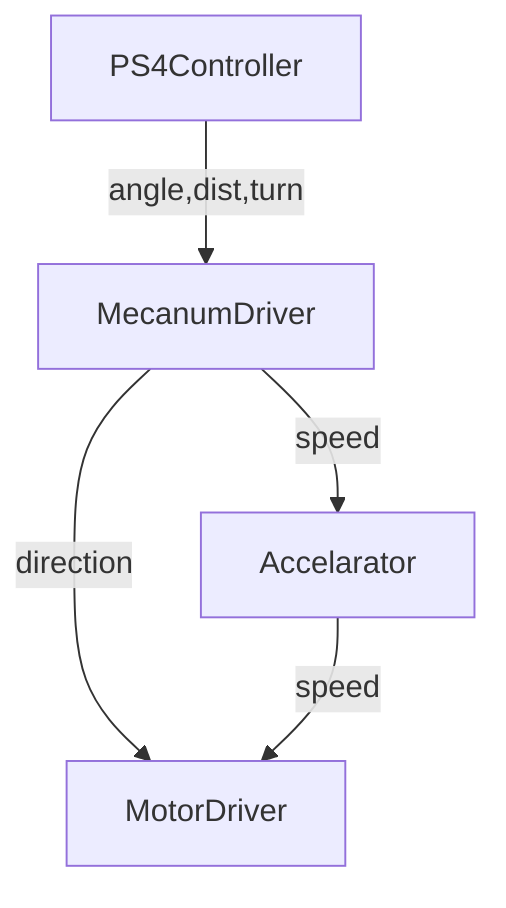
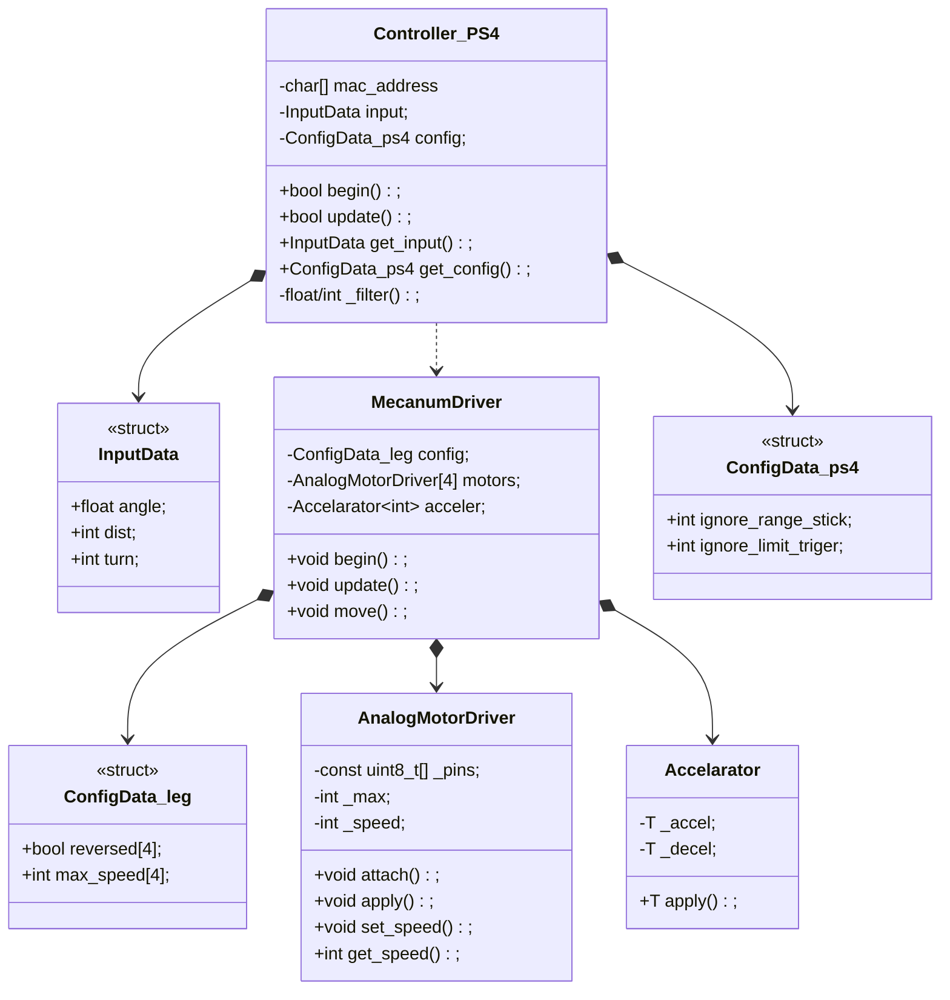

# Planaria

Planaria(レスコン2号機)をPS4コントローラーで動かそう！

## やってみた

### ファイル構成

```text
Planaria_renewal/
├─ mitochondria_renewal/
│  ├─ src/
│  │  ├─ Controller_PS4.h       # 入力受付
│  │  ├─ MecanumDriver.h        # 出力割り当て
│  │  ├─ Accelarator.h          # 加速度処理
│  │  └─ AnalogMotorDriver.h    # モタドラ用ライブラリ
│  └─ mitochondria_renewal.ino  # 本体
├─ LICENSE
└─ README.md
```

srcフォルダを中に作ることで一緒にコンパイルしてくれる(中でもう一段階ネストすることも可能)

### 処理のイメージ

どうも[ブラウザ上](https://github.com/Tomoooji/Planaria_renewal/tree/example/tomoooji/README.md)じゃないと図にならないみたい



コントローラーからの入力をController側で受けて、inputに格納 -> loop関数内でDriverの関数に引数として渡す形。入出力の設定(モーターのゲインとかジョイスティックの閾値とか)はそれぞれのクラスのconfigに格納して随時参照する。

> 機能追加時は
>
> - 入力側:Controllerのinputに項目を増やしてupdateに更新処理を書き、入力用設定値をconfigに書く
> - 出力側:Driverを増やすか改造して、configには出力用の設定値を書く
> - main:loop関数内で入力値(Controller.get_input().~~)を参照してDriver側の関数に引数で渡す

### 各クラスの詳細

どうも[ブラウザ上](https://github.com/Tomoooji/Planaria_renewal/tree/example/tomoooji/README.md)じゃないと図にならないみたい



## 参考資料

### PS4コントローラー用ライブラリ

https://www.notion.so/1-278b1970b55980219e2ada5c3cee0d8a?source=copy_link#339b1970b559803386fdc83a87f020f7

- ライブラリマネージャーで検索してinstall
- setup内でPS4beginにMACアドレスを渡して、loop内で各ボタンの入力を関数から受け取る(多分単なるgetter)。

### 過去コード?

https://www.notion.so/ESP32-_-2023-bd5f8e22e0a543179b6db6474eb22fe5?source=copy_link  
ぶっちゃけあんまり参考にはならないです。悪しからず

---

最終更新:2026-05-12
