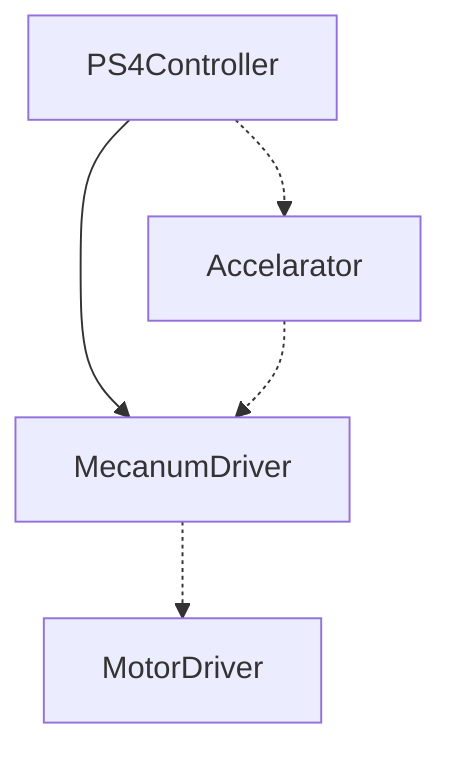
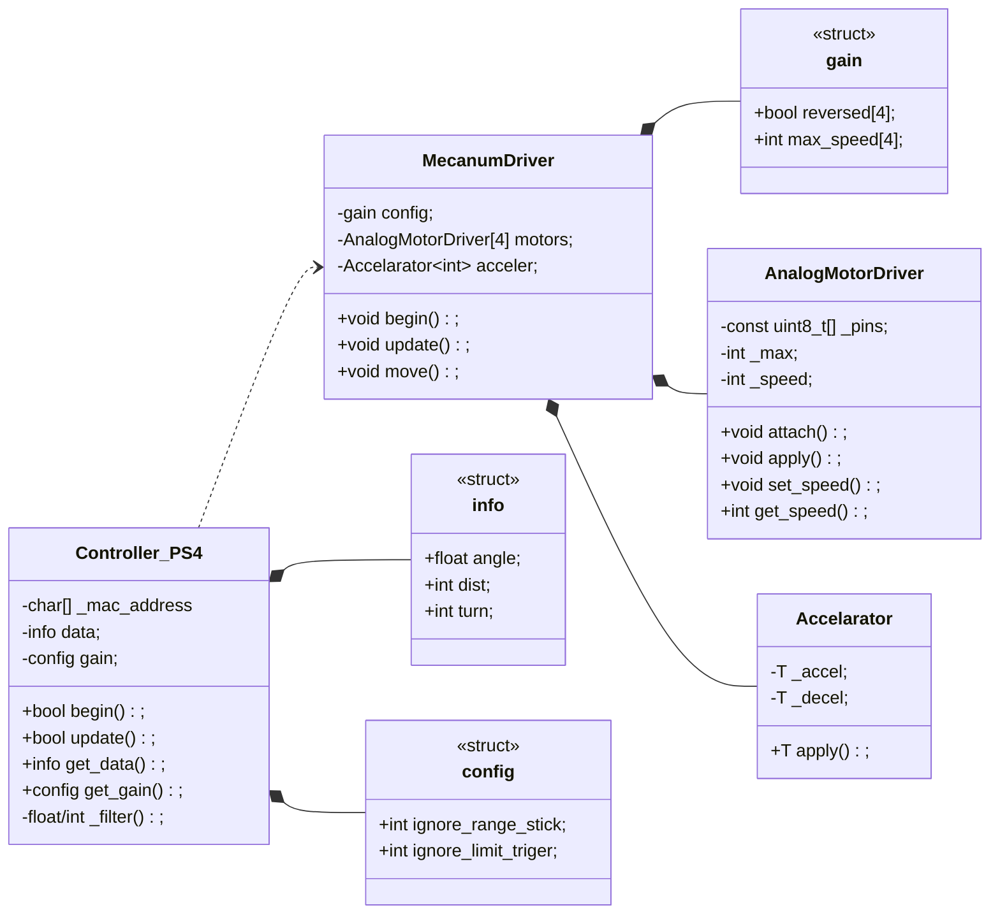

# Planaria

Planaria(レスコン2号機)をPS4コントローラーで動かそう！
基本的にこっち(devブランチ)で開発していく。

## やってみた
### ファイル構成
```text
Planaria_renewal/
├─ src/
│  └─ mitochondria_renewal/
│     ├─ mitochondria_renewal.ino   # 本体
│     ├─ Controller_PS4.h           # 入力受付
│     ├─ MecanumDriver.h            # 出力割り当て
│     ├─ AnalogMotorDriver.h        # モタドラ用ライブラリ
│     └─ Accelarator.h              # 加速度処理
├─ LICENSE
└─ README.md
```
### 処理のイメージ
どうもブラウザ上じゃないと図にならないみたい

### 各クラスの詳細
どうもブラウザ上じゃないと図にならないみたい

## 参考資料

### PS4コントローラー用ライブラリ

https://www.notion.so/1-278b1970b55980219e2ada5c3cee0d8a?source=copy_link#339b1970b559803386fdc83a87f020f7

- ライブラリマネージャーで検索してinstall
- setup内でPS4beginにMACアドレスを渡して、loop内で各ボタンの入力を関数から受け取る(単なるゲッターなのか通信してるのかはよくわからん)。

### 過去コード?

https://www.notion.so/ESP32-_-2023-bd5f8e22e0a543179b6db6474eb22fe5?source=copy_link
ぶっちゃけあんまり参考にはならないです。悪しからず
